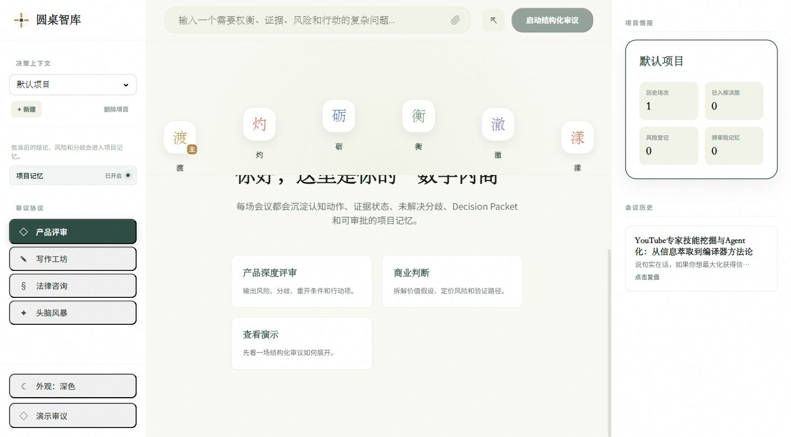
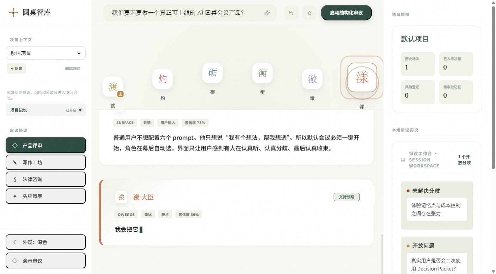

<p align="center">
  <a href="./README.md">中文</a> · <strong>English</strong>
</p>

# AI Roundtable Room

Give a hard question to several AI roles and get back a decision packet you can inspect, challenge, export, and reuse in the next discussion.

You do not have to write six prompts by hand or stitch together several model replies. Enter a question, choose a deliberation protocol, and the room moves through moderator framing, strong opinions, risk review, evidence checks, user perspective, and final synthesis. Along the way it keeps track of disagreements, evidence status, open questions, risks, and action items.





## 24-Second Explainer

The repo includes a Remotion explainer video: [roundtable-explainer.mp4](./artifacts/roundtable-explainer.mp4)

```bash
npm run video:studio
npm run video:render
```

## When It Helps

- Product, engineering, growth, and business calls where you need options, objections, risks, and launch conditions.
- Writing, legal, consulting, and review work where different perspectives should challenge each other.
- Ongoing project discussions where approved conclusions, risks, disagreements, and actions should carry into the next meeting.
- Local custody of model keys, with API keys read on the server instead of exposed to the browser.

## How It Differs From One Chat Prompt

A single model prompt usually gives you an answer. AI Roundtable Room keeps the decision trail: which role argued for what, where evidence is missing, which disagreement changes the recommendation, and what should trigger a new review.

Each meeting moves through framing, divergence, tension surfacing, examination, convergence, and final decision. The final Decision Packet includes the selected path, minority report, remaining risks, reopen conditions, and action items. You can export the minutes or approve useful findings into project memory.

## Quick Start

Windows:

```bat
start.bat
```

macOS / Linux:

```bash
bash start.sh
```

On first run, the script copies `.env.example` to `.env`. Fill at least:

```bash
AI_PROVIDERS=openai
OPENAI_API_KEY=your-api-key
OPENAI_MODEL=gpt-5.5
```

Then open:

```text
http://127.0.0.1:5173
```

Without an API key, the app still opens and lets you view the demo deliberation. Real generation starts after you configure a provider and restart the server.

## Model Setup

For a single provider, keep the minimal setup:

```bash
AI_PROVIDERS=openai
OPENAI_API_KEY=your-api-key
OPENAI_BASE_URL=
OPENAI_MODEL=gpt-5.5
```

If you use a proxy or an OpenAI-compatible provider, set the matching `BASE_URL` and `MODEL`.

Multiple providers can rotate across roles:

```bash
AI_PROVIDERS=openai,deepseek,glm

OPENAI_API_KEY=your-openai-key
OPENAI_MODEL=gpt-5.5

DEEPSEEK_API_KEY=your-deepseek-key
DEEPSEEK_BASE_URL=https://api.deepseek.com
DEEPSEEK_MODEL=deepseek-chat

GLM_API_KEY=your-glm-key
GLM_BASE_URL=https://open.bigmodel.cn/api/paas/v4
GLM_MODEL=glm-4.5
```

Pin selected roles to specific providers:

```bash
ROLE_PROVIDERS=li:deepseek,heng:openai,che:glm
```

Claude Messages API:

```bash
AI_PROVIDERS=claude
CLAUDE_TYPE=claude
CLAUDE_API_KEY=your-claude-key
CLAUDE_BASE_URL=https://api.anthropic.com
CLAUDE_MODEL=claude-sonnet-4-5-20250929
```

## Common Commands

| Command | Purpose |
| --- | --- |
| `npm run dev` | Start the local development server |
| `npm run doctor` | Check `.env`, providers, models, and access protection |
| `npm test` | Run Vitest tests |
| `npm run build` | Build frontend production assets |
| `npm run start` | Start the production server |
| `npm run check` | Run tests, build, and dependency audit |
| `npm run video:studio` | Open the Remotion video preview |
| `npm run video:render` | Render the project explainer video |

## Public Deployment

Production start:

```bash
npm run build
npm run start
```

For public deployments, set an access code and session secret so visitors cannot spend your model budget:

```bash
APP_ACCESS_CODE=your-private-code
SESSION_SECRET=your-long-random-secret
DAILY_MEETING_LIMIT=80
```

Docker:

```bash
docker build -t ai-roundtable-room .
docker run --rm -p 5173:5173 --env-file .env ai-roundtable-room
```

## Project Layout

```text
server/                 Express server, model providers, sessions, rate limits, meeting generation
src/                    React frontend, UI components, export logic, browser API calls
shared/personas.js      Shared personas and deliberation protocols
remotion/               Source for the visual explainer video
public/remotion/        Static screenshots used by Remotion
artifacts/              README screenshots and explainer video
docs/                   Architecture, security audit, roadmap, and product notes
roundtable-projects/    Local project snapshots maintained at runtime
```

## Maintainer Links

- Architecture: [docs/architecture.md](docs/architecture.md)
- Security audit: [docs/security-audit.md](docs/security-audit.md)
- Roadmap: [docs/roadmap.md](docs/roadmap.md)
- Contributing: [CONTRIBUTING.md](CONTRIBUTING.md)

## License

MIT
