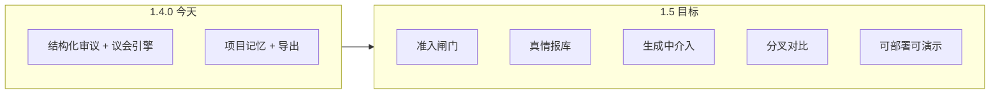
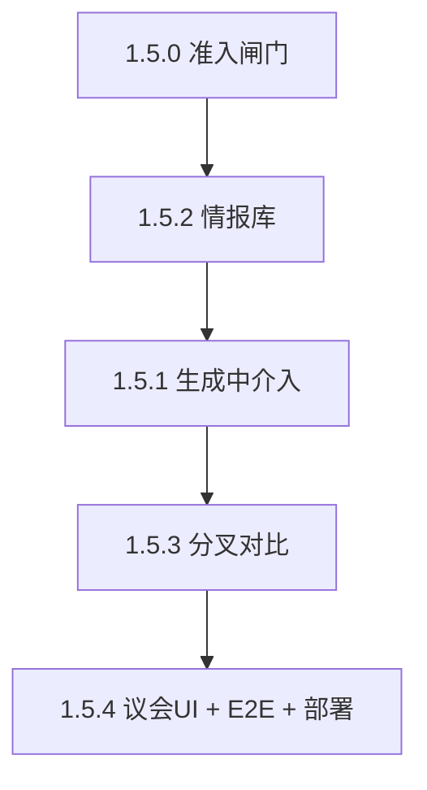

# 1.5 路线图：严肃决策工作台

> 评估基准日：2026-06-03 · 当前版本 **1.4.0**  
> 北极星：`docs/north-star-goal.md` · 战略：`docs/strategic-decisions.md`（A 本地专业 + E 可选协作后置）

---

## 一、当前作品打分（诚实版）

采用 **北极星七条最低标准** + **工程成熟度** 双轨评分（10 分制），加权得到总分。

| 维度 | 得分 | 说明 |
|------|------|------|
| 明确准入（该不该开圆桌） | **6.5** | 有议题教练/预检，缺硬性「不适合则劝退」与单模型替代路径 |
| 不可替代视角差异 | **7.5** | 职责合约 + 多判断函数 prompt 成熟；角色仍偏固定人设 |
| 真实冲突 | **8.0** | tensions / 少数意见 / residualObjections 结构完整 |
| 证据与置信度 | **7.0** | 证据强制 + 矩阵导出好；**真检索/RAG 未做**，URL 抓取较浅 |
| 结构化产物 | **8.5** | Decision Packet、结果四格、导出链路过关 |
| 用户介入节点 | **6.5** | 干预约束、fork、继续审议有；**生成中暂停/改向**仍弱 |
| 可复盘性 | **8.0** | 项目记忆 + 人工审批 + 任务时间线 + 审计导出 |
| 工程与可信度 | **8.5** | 187 测试、doctor、多 provider、黄金路径 API |
| 产品完成度（UX/分发） | **7.0** | 1.3.29 小白路径明显改善；部署模板、E2E 浏览器层仍缺 |

**加权总分：约 7.4 / 10（74 分）**

### 分层定位（方便对外说）

| 层级 | 判断 |
|------|------|
| vs 玩具多 Agent 聊天 | **明显领先**（结构、证据、收束、非表演导向） |
| vs LLM Council 类 demo | **叙事更强**（议题教练、工作台、项目记忆）；**多模型互评**仅多 API 时默认开 |
| vs Roundtable.now 等企业品 | **差一截**（连接器、团队流、实时推理、合规） |
| vs 你们自己的北极星 | **约完成 65–70%**，差的是「准入、真情报、生成中控制、可对比分叉」 |

### 1.4.0 之后的关键增量（已得分）

- 认知议会三阶段（多 API）
- 干预 context + fork API
- 情报 URL/片段接入
- 盲评长度校正 + 审计页

### 仍拖累分数的短板（1.5 应主攻）

1. **单 API 用户感受不到「议会」**（`council.enabled` 仅多 provider 默认 true）
2. **情报不是「可检索证据库」**（无持久文档索引、无发言↔段落级引用）
3. **用户介入偏「发起前/结束后」**，审议进行中难以改向
4. **分叉第二场**无 UI 对比，roadmap「整场重跑/批量重生成」未做
5. **公开分发**（部署模板、稳定 E2E）未完成

---

## 二、距离 1.5 还有多远？

**定义 1.5**：用户能 **每周用本产品做一次真实高价值决策**，并愿意向同事推荐——对应北极星完成度 **≥ 85%**。

| 指标 | 1.4.0 估算 | 1.5 目标 | 差距 |
|------|------------|----------|------|
| 北极星完成度 | ~68% | ~85% | **~17pt** |
| 版本工作量（人周，solo+AI） | — | — | **约 4–6 人周** |
| 发布节奏 | — | 5 个小版本或 2 个大版本 | 见下文 |

**结论**：不是「再加几个小按钮」，而是 **4 条能力纵深的补齐** + **1 条分发/质量底线**。距离 1.5 大约 **1 个冲刺周期（3–4 周全职）** 或 **2 个月业余**，取决于是否做检索后端。

---

## 三、1.5 北极星一句话

> **从「能开一场像样的审议」升级到「敢用它在真实决策里下注」。**

不扩：账号体系、千 Agent 仿真、ToB 连接器矩阵（留给 1.6+ / E 路径）。

---

## 四、1.5 发布切片（推荐）

### 1.5.0 — 议题准入闸门（North Star §1）

**目标**：系统明确回答「该不该开圆桌」，减少误用与 token 浪费。

| 任务 | 验收标准 |
|------|----------|
| 议题分类器（规则 + 可选轻量 LLM） | 事实查询/润色类 → 提示「建议单模型」并给一键跳转说明 |
| 发起前「审议价值」卡片 | 显示：冲突预期、证据需求、建议席位 preset |
| 与议题教练合并 | 同一面板，无第二套入口 |

**不做**：自动拒绝用户（只劝退 + 二次确认）。

---

### 1.5.1 — 生成中用户介入（North Star §6 + roadmap §2）

**目标**：审议不是黑盒跑完，关键节点可停、可改。

| 任务 | 验收标准 |
|------|----------|
| 流式/分阶段生成 API | 至少：议会三阶段 → 碰撞回合 **分段返回** SSE 或 polling |
| UI：暂停 / 注入约束 / 跳过下一阶段 | 暂停后 resume；注入写入下一段 prompt |
| 与现有 `cancelGeneration` 统一 | 取消 = 保留已生成片段 + 可「从当前收束」 |

**依赖**：`server/meeting.js` 拆分 `createRoutedMeeting` 为可中断步骤机。

---

### 1.5.2 — 项目情报库（North Star §4 + roadmap §3）

**目标**：证据可复盘、可引用，而非一次性 context 粘贴。

| 任务 | 验收标准 |
|------|----------|
| 项目级 `intelDocuments[]`（localStorage + project-files 同步） | PDF/MD/URL 入库，带 id、摘要、抓取时间 |
| 发起审议时勾选材料 | evidence pool 预填；发言 citations 含 `docId` |
| 检索（MVP） | 议题 + 材料 top-k 片段注入 context（关键词或 embedding 二选一） |
| 证据矩阵升级 | 列：材料来源段落 |

**MVP 建议**：先 **关键词 + 段落切分**，避免首版绑死 embedding 服务。

---

### 1.5.3 — 分叉对比工作台（1.4.1 产品化）

**目标**：「假设 A vs B」可看见差异，而不只是第二场新会议。

| 任务 | 验收标准 |
|------|----------|
| Fork 元数据持久化到 project | `parentMeetingId`、`forkLabel` 在历史列表可见 |
| 对比视图 | 并排：Decision Packet、top 3 tensions、action items diff |
| 可选「仅重跑收束」fork | 同 transcript 不同约束 → 只调 `refresh-closure` |

---

### 1.5.4 — 认知议会产品化 + 质量底线

| 任务 | 验收标准 |
|------|----------|
| 单 API 也可开「议会模式」（可选，默认关） | UI 开关 + 成本提示文案 |
| 席位↔模型映射 UI | 读写 `ROLE_PROVIDERS`，不必手改 .env |
| Playwright E2E | 覆盖：演示 → 配置提示 → 导出 HTML |
| 部署模板 | `docker-compose` 文档 + Render/Fly 示例 env |

---

## 五、优先级与依赖（执行顺序）

| 优先级 | 版本 | 理由 |
|--------|------|------|
| P0 | 1.5.0 | 低成本、立刻提升「严肃感」与误用率 |
| P0 | 1.5.2 | 补齐最大信任缺口（真证据） |
| P1 | 1.5.1 | 工程量大，但是北极星「用户介入」核心 |
| P1 | 1.5.3 | 复用 1.4.1 fork，主要是 UI |
| P2 | 1.5.4 | 发布与传播 |

---

## 六、每项改动的北极星自检（强制）

合并 PR 前逐条答：

1. 是否提升问题/判断/行动质量？
2. 是否减少无意义表演？
3. 分歧是否更清晰？
4. 用户是否更容易介入？
5. 是否可沉淀为项目记忆？
6. 是否证明圆桌比单模型更值得？

任两条为否 → 砍 scope。

---

## 七、1.5 完成后的预期分数

| 维度 | 1.4.0 | 1.5 预期 |
|------|-------|----------|
| 准入 | 6.5 | **8.5** |
| 证据 | 7.0 | **8.5** |
| 用户介入 | 6.5 | **8.5** |
| 可复盘 | 8.0 | **9.0** |
| 分发/工程 | 7.0 | **8.5** |
| **总分** | **7.4** | **~8.3** |

---

## 八、你需要先定的 3 个产品决策

在开工 1.5.0 前请拍板（回复 A/B/C 即可）：

1. **情报检索 MVP**  
   - **A**：关键词 + 段落（无新依赖，2 周内）  
   - **B**：本地 embedding（如 Ollama / 兼容 API，3–4 周）  

2. **生成中介入深度**  
   - **A**：仅「阶段闸门」（议会 3 段 + 碰撞分 2 段，可暂停注入）  
   - **B**：每轮发言后都可停（成本与复杂度高一倍）  

3. **1.5 范围**  
   - **A**：全做 1.5.0–1.5.4（约 4–6 人周）  
   - **B**：只做 1.5.0 + 1.5.2 + 1.5.3（约 2–3 人周），介入推到 1.6  

---

## 九、文档与代码落点（实施时）

| 能力 | 主要文件 |
|------|----------|
| 准入 | `src/lib/topicCoach.js`, `TopicPreflightBar`, `server/meeting.js` 前置检查 |
| 情报库 | 新 `server/intel-store.js`, `src/lib/intelDocuments.js`, 扩展 `project-files.js` |
| 生成中介入 | `server/meeting.js` 状态机, `server/app.js` SSE, `App.jsx` |
| 分叉对比 | `src/components/ForkComparePanel.jsx`, `src/lib/forkCompare.js` |
| 议会 UI | `WorkbenchDraft`, `docs/.env` 映射组件 |

---

*本计划与 `docs/roadmap.md` 关系：roadmap 中「待做」项并入 1.5.x；完成后应回写 roadmap + CHANGELOG。*